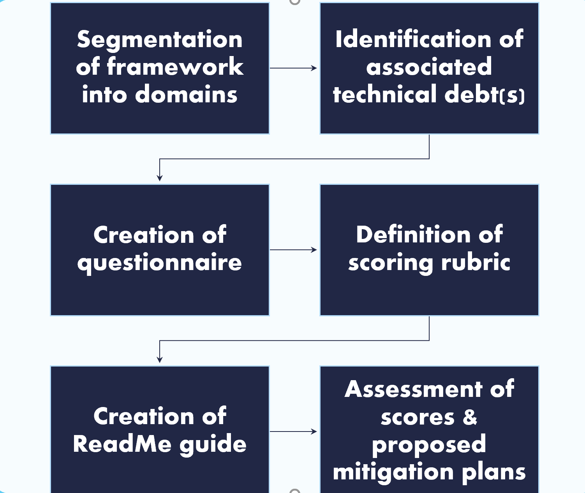
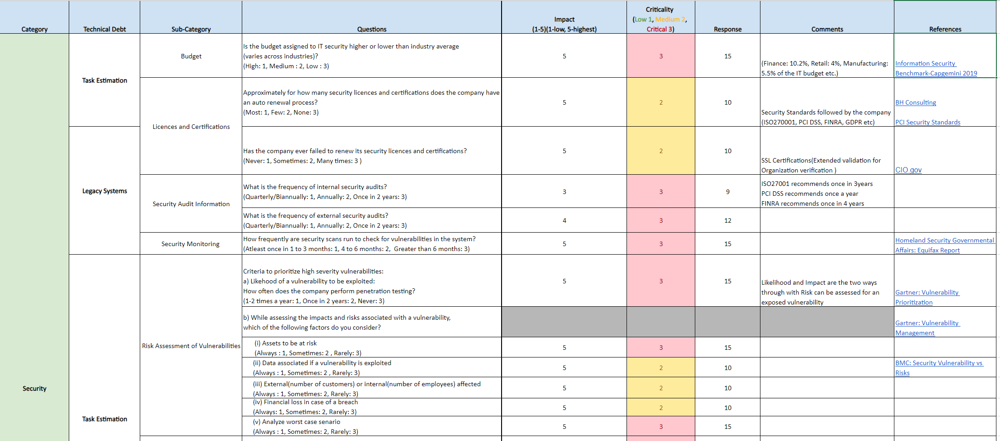
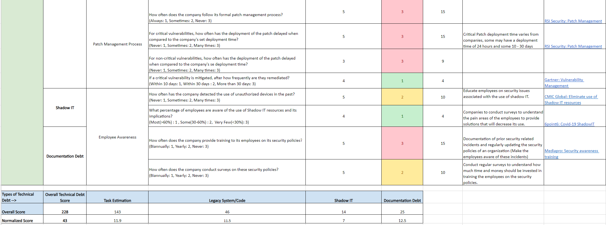
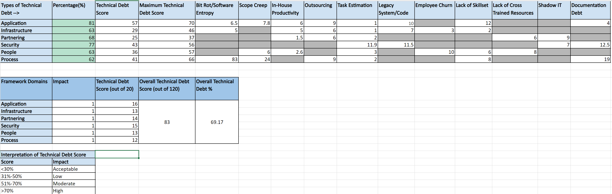

# Assessment-of-Technical-Debt
An approach to quantify Technical Debt in an organization across various domains

## Objective
- Investigate the types of technical debt and the impact on the organization
- Build a framework to quantify and prioritize the domains that have greater technical debt 

## Identified the types of Technical Debt that could possibly exist
- Bit Rot/Software Entropy
- Legacy System (Code)
- Shadow IT 
- Scope Creep
- Employee Churn 
- Lack of Skillset
- Lack of Cross Trained Resources 
- In-House Productivity 
- Outsourcing
- Documentation Debt
- Task Estimation  

## 7 domains where Technical Debt could exist
- Application
- Infrastructure
- Partnering
- People
- Process
- Security

## Proposed approach for assessing Technical Debt

## Sample Questionnaire - Security

### You can get score generated ont bases of criticality and weightage

## Results

- Technical debt score for each domain – split across each debt type.
- Technical debt percentage for each domain to identify the domain with the highest tech debt.
- Overall tech debt score and percentage to assess the total tech debt.

